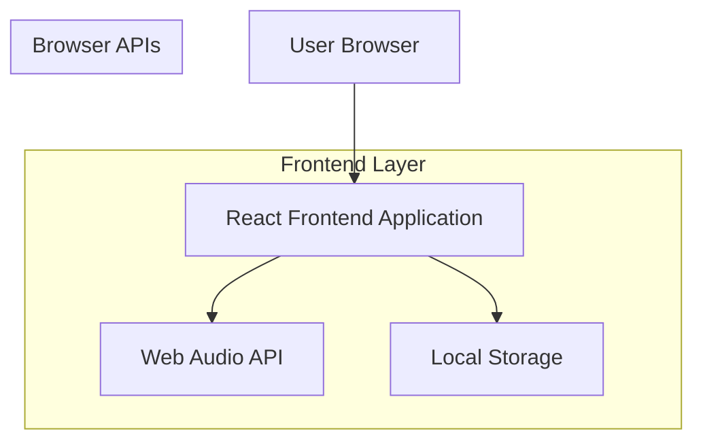

## 1. Architecture Design



## 2. Technology Description

* **Frontend**: React\@18 + tailwindcss\@3 + vite

* **Initialization Tool**: vite-init

* **Backend**: None (GitHub Pages static hosting)

* **Audio**: Web Audio API for musical tone generation

* **Storage**: Browser Local Storage for progress persistence

## 3. Route Definitions

| Route         | Purpose                                         |
| ------------- | ----------------------------------------------- |
| /             | Game page - main gameplay interface             |
| /instructions | Instructions page - game rules and tutorial     |
| /achievements | Achievements page - badges and unlocked content |

## 4. Core Components

### 4.1 Piano Component

```typescript
interface PianoKey {
  note: string;
  frequency: number;
  isPressed: boolean;
}

interface PianoProps {
  onKeyPress: (note: string) => void;
  highlightedKeys: string[];
  disabled: boolean;
}
```

### 4.2 Game State Management

```typescript
interface GameState {
  currentLevel: 3 | 6 | 8 | 12;
  currentSequence: string[];
  userSequence: string[];
  score: number;
  highScore: number;
  lives: number;
  isPlayingSequence: boolean;
  gamePhase: 'idle' | 'playing' | 'input' | 'success' | 'failure';
}

interface Achievement {
  id: string;
  name: string;
  description: string;
  requirement: number;
  unlocked: boolean;
  unlockedDate?: Date;
}
```

### 4.3 Audio Service

```typescript
class AudioService {
  private audioContext: AudioContext;
  
  constructor() {
    this.audioContext = new AudioContext();
  }
  
  playNote(note: string, duration: number = 0.3): void {
    // Generate piano tone using Web Audio API
    const oscillator = this.audioContext.createOscillator();
    const gainNode = this.audioContext.createGain();
    
    oscillator.frequency.value = this.getNoteFrequency(note);
    oscillator.type = 'sine';
    
    gainNode.gain.setValueAtTime(0.3, this.audioContext.currentTime);
    gainNode.gain.exponentialRampToValueAtTime(0.01, this.audioContext.currentTime + duration);
    
    oscillator.connect(gainNode);
    gainNode.connect(this.audioContext.destination);
    
    oscillator.start();
    oscillator.stop(this.audioContext.currentTime + duration);
  }
  
  private getNoteFrequency(note: string): number {
    const noteFrequencies: Record<string, number> = {
      'C4': 261.63, 'C#4': 277.18, 'D4': 293.66, 'D#4': 311.13,
      'E4': 329.63, 'F4': 349.23, 'F#4': 369.99, 'G4': 392.00,
      'G#4': 415.30, 'A4': 440.00, 'A#4': 466.16, 'B4': 493.88
    };
    return noteFrequencies[note] || 440;
  }
}
```

## 5. Local Storage Schema

### 5.1 Game Progress Storage

```typescript
interface StoredGameData {
  highScore: number;
  totalGamesPlayed: number;
  achievements: Achievement[];
  unlockedAudioSnippets: string[];
  lastPlayedLevel: 3 | 6 | 8 | 12;
}

// Storage key: 'musicalMemoryGame_data'
```

### 5.2 Achievement Definitions

```typescript
const ACHIEVEMENTS: Achievement[] = [
  {
    id: 'first_sequence',
    name: 'First Success',
    description: 'Complete your first sequence',
    requirement: 1,
    unlocked: false
  },
  {
    id: 'sequence_master_10',
    name: 'Sequence Master',
    description: 'Complete 10 sequences in a row',
    requirement: 10,
    unlocked: false
  },
  {
    id: 'sequence_master_20',
    name: 'Sequence Expert',
    description: 'Complete 20 sequences in a row',
    requirement: 20,
    unlocked: false
  },
  {
    id: 'level_complete_3',
    name: 'Easy Champion',
    description: 'Reach sequence length 15 on Easy mode',
    requirement: 15,
    unlocked: false
  },
  {
    id: 'level_complete_6',
    name: 'Medium Champion',
    description: 'Reach sequence length 15 on Medium mode',
    requirement: 15,
    unlocked: false
  },
  {
    id: 'level_complete_8',
    name: 'Hard Champion',
    description: 'Reach sequence length 15 on Hard mode',
    requirement: 15,
    unlocked: false
  },
  {
    id: 'level_complete_12',
    name: 'Expert Champion',
    description: 'Reach sequence length 15 on Expert mode',
    requirement: 15,
    unlocked: false
  }
];
```

## 6. Game Logic Implementation

### 6.1 Sequence Generation

```typescript
class SequenceGenerator {
  private notes: string[] = ['C4', 'C#4', 'D4', 'D#4', 'E4', 'F4', 'F#4', 'G4', 'G#4', 'A4', 'A#4', 'B4'];
  
  generateSequence(length: number, level: number): string[] {
    const sequence: string[] = [];
    const availableNotes = this.notes.slice(0, level);
    
    for (let i = 0; i < length; i++) {
      const randomNote = availableNotes[Math.floor(Math.random() * availableNotes.length)];
      sequence.push(randomNote);
    }
    
    return sequence;
  }
}
```

### 6.2 Game Engine

```typescript
class GameEngine {
  private gameState: GameState;
  private sequenceGenerator: SequenceGenerator;
  private audioService: AudioService;
  
  startNewGame(level: number): void {
    this.gameState = {
      currentLevel: level as 3 | 6 | 8 | 12,
      currentSequence: this.sequenceGenerator.generateSequence(level, level),
      userSequence: [],
      score: 0,
      highScore: this.getStoredHighScore(),
      lives: 3,
      isPlayingSequence: false,
      gamePhase: 'idle'
    };
  }
  
  async playSequence(): Promise<void> {
    this.gameState.isPlayingSequence = true;
    this.gameState.gamePhase = 'playing';
    
    for (const note of this.gameState.currentSequence) {
      this.audioService.playNote(note);
      await this.delay(400);
    }
    
    this.gameState.isPlayingSequence = false;
    this.gameState.gamePhase = 'input';
  }
  
  handleUserInput(note: string): void {
    if (this.gameState.gamePhase !== 'input') return;
    
    this.gameState.userSequence.push(note);
    this.audioService.playNote(note);
    
    const currentIndex = this.gameState.userSequence.length - 1;
    
    if (this.gameState.userSequence[currentIndex] !== this.gameState.currentSequence[currentIndex]) {
      this.handleIncorrectInput();
    } else if (this.gameState.userSequence.length === this.gameState.currentSequence.length) {
      this.handleCorrectSequence();
    }
  }
  
  private handleCorrectSequence(): void {
    this.gameState.score++;
    this.gameState.gamePhase = 'success';
    
    // Check achievements
    this.checkAchievements();
    
    // Generate next sequence (increase length)
    setTimeout(() => {
      this.gameState.currentSequence = this.sequenceGenerator.generateSequence(
        this.gameState.currentSequence.length + 1,
        this.gameState.currentLevel
      );
      this.gameState.userSequence = [];
      this.playSequence();
    }, 1000);
  }
  
  private handleIncorrectInput(): void {
    this.gameState.lives--;
    this.gameState.gamePhase = 'failure';
    
    if (this.gameState.lives <= 0) {
      this.endGame();
    } else {
      // Retry same sequence
      setTimeout(() => {
        this.gameState.userSequence = [];
        this.playSequence();
      }, 1000);
    }
  }
}
```

## 7. Deployment Configuration

### 7.1 GitHub Pages Setup

```json
// package.json scripts
{
  "scripts": {
    "build": "vite build",
    "deploy": "npm run build && gh-pages -d dist"
  }
}

// vite.config.js
export default {
  base: '/musical-memory-game/',
  build: {
    outDir: 'dist',
    assetsDir: 'assets'
  }
}
```

### 7.2 Build Optimization

* Code splitting for faster initial load

* Audio file preloading for reward snippets

* Service worker for offline capability

* Image optimization for achievement badges

