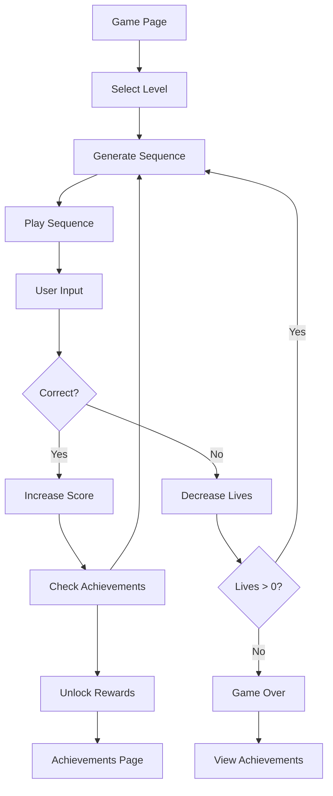

## 1. Product Overview
A web-based musical memory game that challenges players to repeat increasingly complex sequences of musical notes. Players listen to note sequences and must reproduce them by clicking on corresponding piano keys. The game features multiple difficulty levels, progressive sequence building, and achievement rewards.

This ad-free version will be hosted on GitHub Pages, providing an educational and entertaining musical memory training experience accessible to anyone with a web browser.

## 2. Core Features

### 2.1 User Roles
| Role | Registration Method | Core Permissions |
|------|---------------------|------------------|
| Guest Player | No registration required | Play all levels, view achievements, local progress tracking |

### 2.2 Feature Module
Our musical memory game consists of the following main pages:
1. **Game Page**: Interactive piano keyboard, sequence display, level selection, score tracking, achievement badges.
2. **Instructions Page**: Game rules, how to play, scoring system explanation.
3. **Achievements Page**: Badge collection, progress statistics, unlocked audio snippets gallery.

### 2.3 Page Details
| Page Name | Module Name | Feature description |
|-----------|-------------|---------------------|
| Game Page | Piano Keyboard | Interactive 12-key piano with visual feedback when notes are played. Each key produces distinct musical tone using Web Audio API. |
| Game Page | Sequence Display | Shows current sequence length and provides visual indicators during playback phase. |
| Game Page | Level Selection | Choose difficulty levels: 3 notes (Easy), 6 notes (Medium), 8 notes (Hard), 12 notes (Expert). |
| Game Page | Game Logic | Generate random note sequences, play sequence audibly, wait for user input, validate sequence accuracy, increment sequence length on success. |
| Game Page | Score Tracking | Display current score, high score, current sequence length, and remaining lives/hearts. |
| Game Page | Achievement System | Award badges for reaching milestones (10 correct sequences, 20 correct sequences, etc.). Unlock musical audio snippets as rewards. |
| Instructions Page | Game Rules | Explain sequence memorization concept, scoring system, level differences, achievement unlock criteria. |
| Instructions Page | How to Play | Step-by-step guide: listen to sequence, watch visual cues, click keys to repeat, progress to longer sequences. |
| Achievements Page | Badge Gallery | Display collected achievement badges with unlock dates and criteria. |
| Achievements Page | Audio Snippets | Showcase unlocked musical pieces that play as rewards for achievements. |
| Achievements Page | Statistics | Show total games played, highest sequence achieved, accuracy percentage, favorite level. |

## 3. Core Process
**Guest Player Flow:**
1. User lands on Game Page with piano keyboard visible
2. User selects difficulty level (3/6/8/12 notes)
3. Game generates random sequence of selected length
4. System plays sequence audibly with visual key highlighting
5. User attempts to reproduce sequence by clicking piano keys
6. System validates input against original sequence
7. On success: increment score, increase sequence length by 1, continue
8. On failure: decrement lives, repeat same sequence length
9. Achievement badges unlock at milestone thresholds
10. Audio snippet rewards become available in achievements gallery

## 4. User Interface Design

### 4.1 Design Style
- **Primary Colors**: Deep purple (#6B46C1) for primary actions, white (#FFFFFF) for backgrounds
- **Secondary Colors**: Gold (#F59E0B) for achievements, red (#EF4444) for errors/hearts
- **Button Style**: Rounded corners with subtle shadows, hover effects for interactivity
- **Font**: Clean sans-serif (Inter or system fonts), 16px base size
- **Layout**: Card-based design with centered content, responsive grid for piano keys
- **Icons**: Musical note icons, trophy badges, heart life counters

### 4.2 Page Design Overview
| Page Name | Module Name | UI Elements |
|-----------|-------------|-------------|
| Game Page | Piano Keyboard | 12 white keys in horizontal layout, subtle hover animations, key press visual feedback with color change, Web Audio API integration for realistic piano tones. |
| Game Page | Control Panel | Level selector dropdown, Start/Reset buttons, score display in large prominent font, heart life counters in top corner. |
| Game Page | Status Display | Current sequence length counter, success/failure feedback messages with color coding, achievement notification popups. |
| Instructions Page | Content Cards | Clean white cards with purple headers, step-by-step numbered instructions, example sequence visualization, scoring table. |
| Achievements Page | Badge Grid | Responsive grid layout for achievement badges, gold border for unlocked badges, gray for locked ones, unlock date tooltips. |
| Achievements Page | Audio Gallery | Playable audio snippet cards with waveform visualization, unlock progress indicators, favorite button functionality. |

### 4.3 Responsiveness
Desktop-first design approach with mobile adaptation. Piano keyboard scales proportionally on smaller screens. Touch interaction optimization for mobile devices with larger tap targets. Achievement gallery switches to single-column layout on mobile devices.